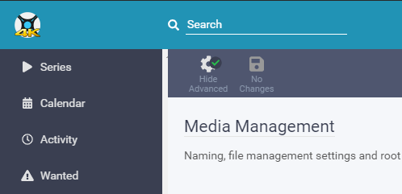
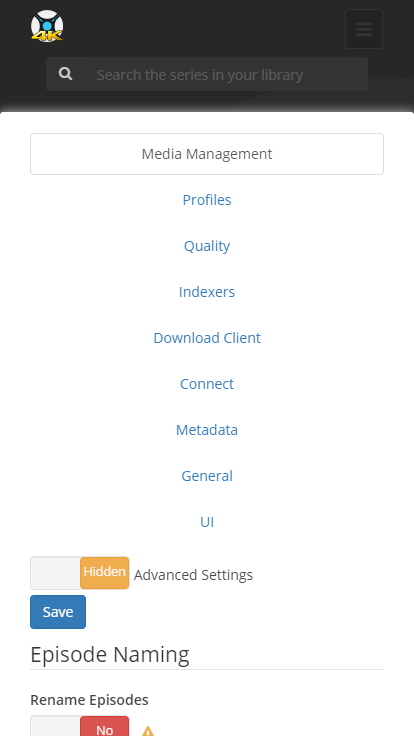
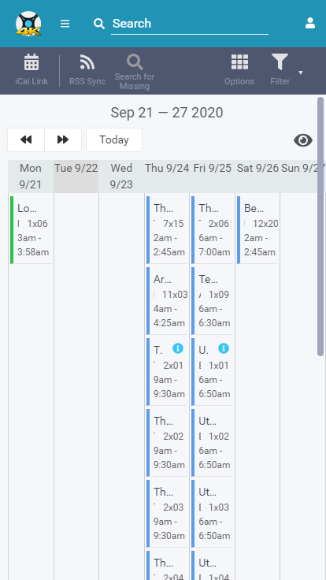

# Sonarr 4K logo

Add a 4K logo to your Sonarr css. 

### Desktop



### Mobile




## Setup

#### Nginx
Examples of how to add it:

```nginx
proxy_set_header Accept-Encoding "";
sub_filter
'</head>'
'<link rel="stylesheet" type="text/css" href="https://gilbn.github.io/theme.park/CSS/themes/sonarr/THEME.css">
<link rel="stylesheet" type="text/css" href="https://gilbn.github.io/theme.park/CSS/addons/sonarr/sonarr-4k-logo.css">
</head>';
sub_filter_once on;
```

#### Apache

```nginx
AddOutputFilterByType SUBSTITUTE text/html
   Substitute 's|</head> '<link rel="stylesheet" type="text/css" href="https://gilbn.github.io/theme.park/CSS/themes/sonarr/THEME.css"><link rel="stylesheet" type="text/css" href="https://gilbn.github.io/theme.park/CSS/addons/sonarr/sonarr-4k-logo.css">
</head>';|'
```

#### Caddy

```nginx
filter rule {
    content_type text/html.*
    search_pattern </head>
    replacement "<link rel='stylesheet' type='text/css' href='https://gilbn.github.io/theme.park/CSS/themes/<APP_NAME>/<THEME>.css'><link rel='stylesheet' type='text/css' href='https://gilbn.github.io/theme.park/CSS/addons/sonarr/sonarr-4k-logo.css'></head>"
}
```

#### Stylus

Just add another import line.

```css
@import "https://gilbn.github.io/theme.park/CSS/themes/sonarr/THEME.css";
@import "https://gilbn.github.io/theme.park/CSS/addons/sonarr/sonarr-4k-logo.css";
```